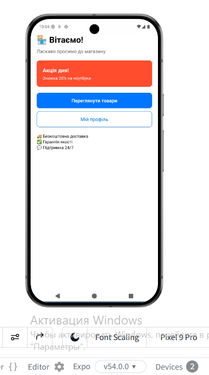
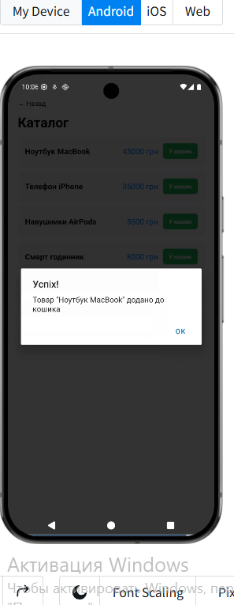
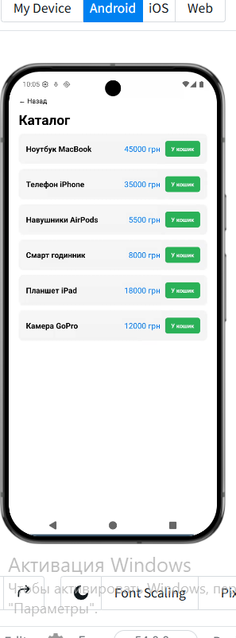
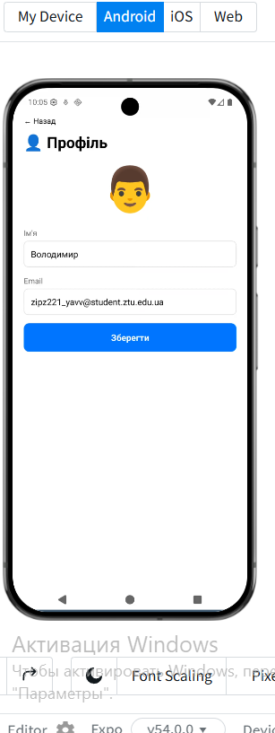

# Лабораторна робота №1

## Тема: Використання Expo для створення найпростішого додатку React Native

---

### Мета

Навчитися створювати та налаштовувати проєкт у середовищі Expo, ознайомитися зі структурою React Native застосунку та опанувати навички роботи з базовими компонентами.

---

### Хід виконання

1. **Вибір середовища розробки**
   - Для виконання лабораторної роботи було обрано онлайн-середовище **Expo Snack** (https://snack.expo.dev)
   - Це дозволило працювати з проєктом без встановлення Node.js та додаткового ПЗ на локальний ПК
   - Додаток запускався на мобільному пристрої через додаток Expo Go

2. **Створення проєкту**
   - Створено новий проєкт в Expo Snack за посиланням: https://snack.expo.dev/@yarosh/lab1
   - Проєкт було названо "Lab1 - Інтернет-Магазин"

3. **Розробка інтерфейсу додатку**
   - Створено головний компонент App.js
   - Реалізовано 4 екрани: Головна, Каталог товарів, Кошик, Профіль
   - Використано базові компоненти React Native:
     - `View` - контейнери
     - `Text` - текст
     - `TouchableOpacity` - кнопки
     - `FlatList` - списки товарів
     - `TextInput` - поля вводу
     - `SafeAreaView` - безпечна область

4. **Реалізація функціоналу**
   - **Головна сторінка:** вітання користувача, банер з акцією, навігаційні кнопки
   - **Каталог товарів:** відображення списку з 6 товарів, кнопка "У кошик"
   - **Кошик:** додавання товарів, підрахунок загальної суми, видалення товарів
   - **Профіль:** редагування імені та email користувача

5. **Запуск та тестування**
   - Додаток було запущено через Expo Snack
   - Відскановано QR-код у додатку Expo Go на мобільному пристрої
   - Перевірено роботу всіх екранів та функцій

---

### Скріншоти роботи додатку

