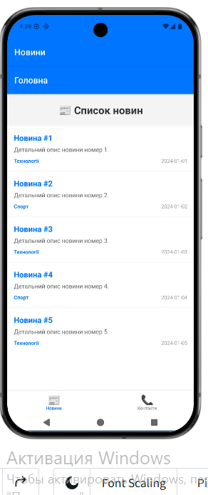
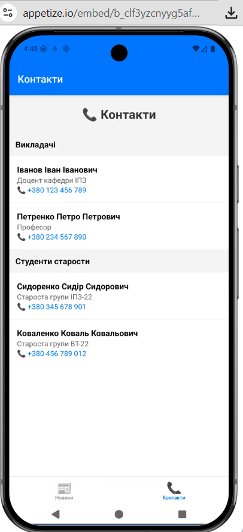
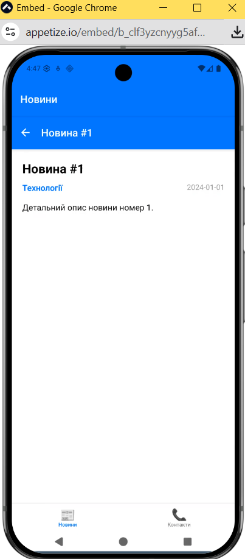
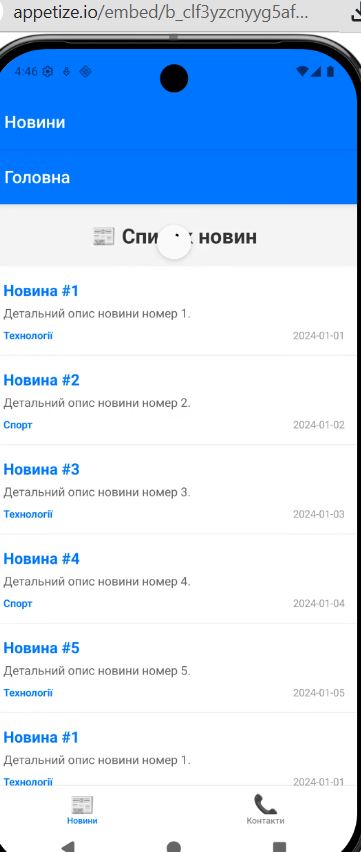
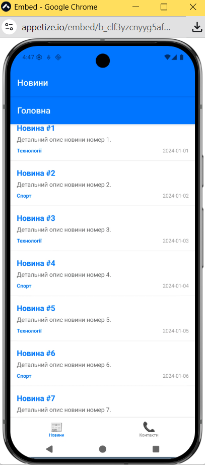

# Лабораторна робота №2

## Тема

Побудова вкладеної навігації та оптимізація відображення великих списків у React Native із використанням компонентів FlatList та SectionList.

---

## Мета

- ознайомлення з принципами навігації у мобільних застосунках React Native;
- вивчення архітектури вкладеної навігації;
- набуття практичних навичок використання Stack Navigator та Tab Navigator;
- засвоєння методів передачі параметрів між екранами;
- опанування ефективного відображення великих наборів даних;
- вивчення механізму віртуалізації списків;
- практичне застосування компонентів FlatList та SectionList;
- формування навичок оптимізації продуктивності мобільних застосунків.

---

## Хід виконання

### 1. Налаштування проєкту (Пункт 2.1)

1. Створено новий проєкт Expo.
2. Встановлено бібліотеки навігації:
   - @react-navigation/native
   - @react-navigation/stack
   - @react-navigation/bottom-tabs

### 2. Модель даних (Пункт 2.2)

Згенеровано тестові дані з полями:
- id — унікальний ідентифікатор
- title — заголовок новини
- description — опис новини
- date — дата публікації
- category — категорія

### 3. Реалізація списку новин — FlatList (Пункт 2.3)

#### 3.1 Pull-to-Refresh (Пункт 2.3.1)

- Використано властивість refreshing={loading}
- Реалізовано функцію onRefresh()
- Імітація мережевого запиту через setTimeout

#### 3.2 Infinite Scroll (Пункт 2.3.2)

- Реалізовано onEndReached
- Встановлено onEndReachedThreshold={0.5}

#### 3.3 Візуальні компоненти списку (Пункт 2.3.3)

- ListHeaderComponent — заголовок списку
- ListFooterComponent — індикатор завантаження
- ItemSeparatorComponent — розділювач елементів

#### 3.4 Оптимізація (Пункт 2.3.4)

- initialNumToRender={10} — початкова кількість елементів
- maxToRenderPerBatch={10} — максимум за партію
- windowSize={10} — розмір вікна прокрутки

### 4. Побудова навігації (Пункт 2.4)

Реалізовано вкладену навігацію: Tab Navigator → Stack Navigator → MainScreen → DetailsScreen.

Передача параметрів здійснюється через navigation.navigate('Details', { news: item }).
Отримання даних: const { news } = route.params.

### 5. Екран контактів — SectionList (Пункт 2.5)

Створено SectionList з:
- sections — масив секцій (Викладачі, Студенти)
- renderItem — рендер елемента
- renderSectionHeader — рендер заголовка секції
- keyExtractor — унікальний ключ
- ItemSeparatorComponent — розділювач

---

## Скріншоти роботи застосунку

