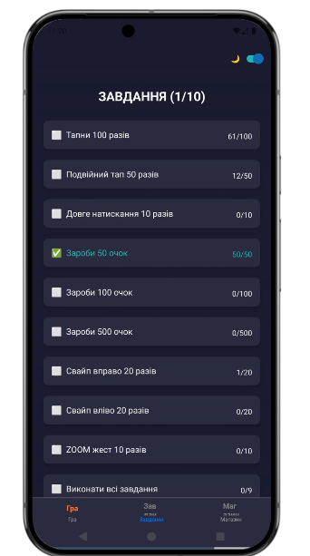
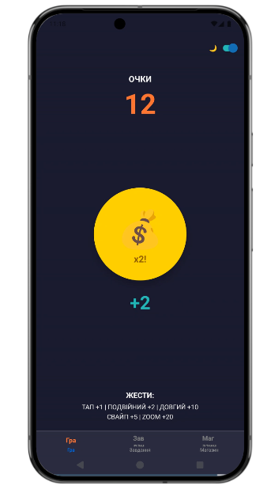
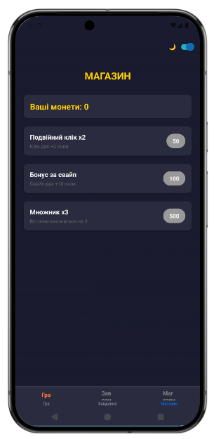
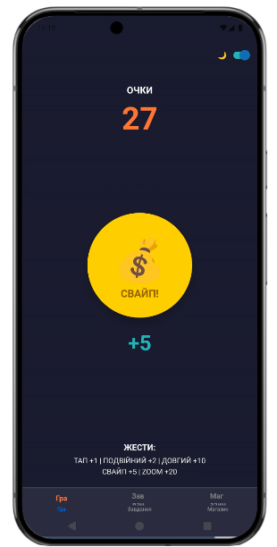
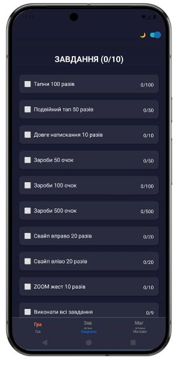
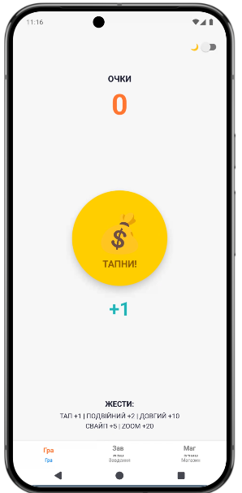
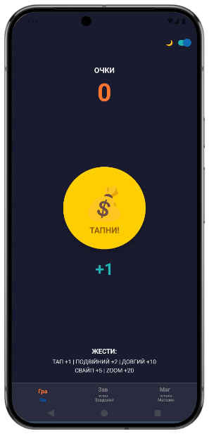

# Лабораторна робота №3

## Тема

Використання кастомних жестів у React Native та стилізація інтерфейсу мобільного застосунку.

---

## Мета

- ознайомлення з принципами обробки жестів користувача у мобільних застосунках React Native;
- вивчення типів жестів (tap, long press, pan, pinch);
- набуття практичних навичок реалізації різних типів жестів;
- опанування стилізації елементів інтерфейсу;
- засвоєння методів підтримки світлої та темної теми;
- формування навичок створення ігрової механіки з елементами клікера.

---

## Хід виконання

### 1. Налаштування проєкту (Пункт 3.1)

Проєкт створено на платформі Expo Snack: https://snack.expo.dev/@yarosh/lab3

Встановлено бібліотеки:
- @react-navigation/native
- @react-navigation/bottom-tabs
- react-native-safe-area-context
- react-native-screens

### 2. Головний екран — ігровий клікер (Пункт 3.2)

#### 2.1 TapGestureHandler — коротке натискання (Пункт 3.2.1)

- Використано компонент TouchableOpacity
- Реалізовано функцію handlePress()
- Нарахування +1 очка за кожне натискання

#### 2.2 Подвійний клік (Пункт 3.2.2)

- Відстеження часу між натисканнями через lastTapTime
- Використано подвійний тап (timeSinceLastTap < 300мс)
- Нарахування +2 очок (або +4 з апгрейдом)

#### 2.3 LongPressGestureHandler — довге натискання (Пункт 3.2.3)

- Використано onLongPress та delayLongPress={3000}
- Утримання 3+ секунди дає +10 очок

#### 2.4 PanGestureHandler — перетягування (Пункт 3.2.4)

- Використано PanResponder
- Відстеження dx (зміщення по осі X)
- Свайп вправо (>80px) — +5 очок
- Свайп вліво (<-80px) — +5 очок

#### 2.5 PinchGestureHandler — масштабування (Пункт 3.2.5)

- Використано onPressIn та onPressOut
- Відстеження часу утримання (500-1500мс)
- "ZOOM" жест дає +20 очок

### 3. Сторінка із завданнями (Пункт 3.3)

Створено 10 завдань:
1. Тапни 100 разів — target: 100
2. Подвійний тап 50 разів — target: 50
3. Довге натискання 10 разів — target: 10
4. Зароби 50 очок — target: 50
5. Зароби 100 очок — target: 100
6. Зароби 500 очок — target: 500
7. Свайп вправо 20 разів — target: 20
8. Свайп вліво 20 разів — target: 20
9. ZOOM жест 10 разів — target: 10
10. Виконати всі завдання — target: 9

Функція updateQuest(id, add) оновлює progress та позначає завдання done при досягненні target.

### 4. Сторінка магазину (Пункт 3.4)

Створено 3 апгрейди:
- Подвійний клік x2 — cost: 50 — Клік дає +2 очки
- Бонус за свайп — cost: 100 — Свайп дає +10 очок
- Множник x3 — cost: 500 — Всі очки множаться на 3

### 5. Навігація (Пункт 3.5)

Використано Bottom Tab Navigator з трьома вкладками: Гра, Завдання, Магазин.

### 6. Стилізація інтерфейсу (Пункт 3.6)

#### 6.1 Кольорова палітра (Пункт 3.6.1)

- primary: #FF6B35
- success: #2EC4B6
- background: #F7F7F7
- gold: #FFD700
- darkBg: #1A1A2E
- darkText: #F7F7F7

#### 6.2 Темна тема (Пункт 3.6.2)

Перемикач Switch для світлої/темної теми.

---

## Скріншоти роботи застосунку

---

## Висновки

У ході виконання лабораторної роботи було розроблено мобільний додаток-гру-клікер з використанням різних типів жестів користувача. Засвоєно принципи роботи з PanResponder для обробки tap, long press, pan та pinch жестів. Реалізовано інтерактивну систему нарахування очок з можливістю придбання бонусів у магазині. Застосовано сучасні підходи до стилізації з підтримкою світлої та темної теми.