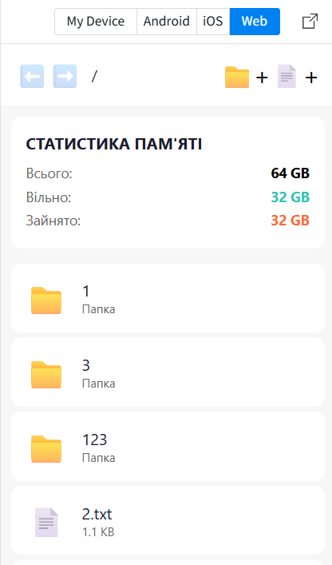
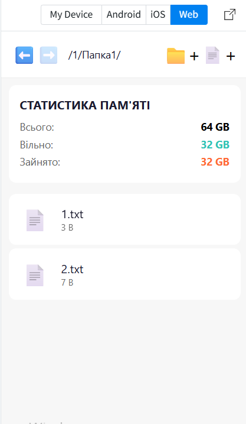
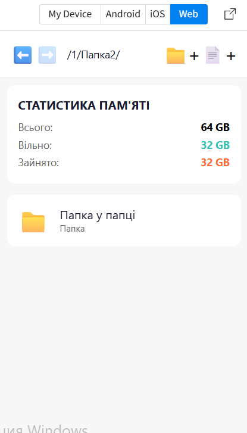
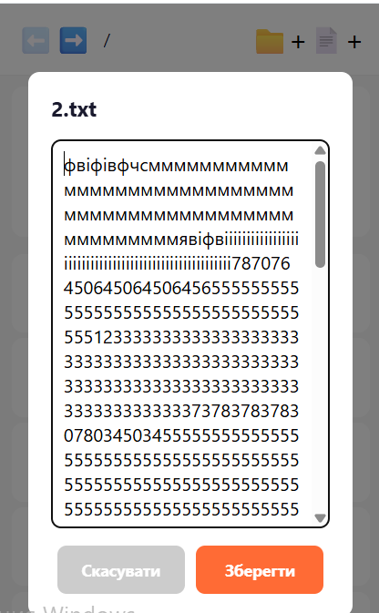

# Лабораторна робота №4

## Тема

Робота з файловою системою в React Native з використанням бібліотеки expo-file-system.

---

## Мета

- ознайомлення з механізмами роботи з локальною файловою системою мобільного пристрою;
- опанування базових операцій над файлами й папками;
- організація файлової навігації;
- аналіз стану файлової системи;
- реалізація перегляду детальної інформації про файл;
- відображення статистики використання пам'яті пристрою.

---

## Хід виконання

### 1. Налаштування проєкту (Пункт 4.1)

Проєкт створено на платформі Expo з використанням AsyncStorage для збереження даних.

Встановлено залежності:
- @react-native-async-storage/async-storage

### 2. Навігація по файловій системі (Пункт 4.2)

#### 2.1 Відображення поточного шляху (Пункт 4.2.1)
- Виведення шляху в header (pathText)
- Формат: /folder/subfolder/

#### 2.2 Перехід між папками (Пункт 4.2.2)
- Перехід вперед: navigateToFolder(folderName)
- Перехід назад: navigateUp() - історія
- Перехід вперед: navigateForward()
- Використано масив history для збереження історії

### 3. Створення файлів та папок (Пункт 4.3)

#### 3.1 Створення папки (Пункт 4.3.1)
- Modal вікно для введення назви
- Функція createFolder()
- Збереження в allData.folders

#### 3.2 Створення файлу (Пункт 4.3.2)
- Modal вікно для введення назви та вмісту
- Функція createFile()
- Автоматичне додавання .txt розширення
- Збереження в allData.files та allData.contents

### 4. Зчитування та редагування (Пункт 4.4)

#### 4.1 Відкриття файлу (Пункт 4.4.1)
- Функція openFile()
- Зчитування вмісту з AsyncStorage
- Відображення в Modal вікні

#### 4.2 Редагування (Пункт 4.4.2)
- Функція saveFile()
- Збереження змін до файлу

### 5. Видалення (Пункт 4.5)
- Функція deleteItem()
- Alert підтвердження
- Видалення з allData

### 6. Перегляд інформації (Пункт 4.6)
Відображення атрибутів:
- Назва файлу
- Тип файлу (Папка/txt)
- Розмір
- Дата останньої модифікації

### 7. Статистика пам'яті (Пункт 4.7)
Відображення на головному екрані:
- Загальний обсяг: 64 GB
- Вільно: 32 GB
- Зайнято: 32 GB

---

## Скріншоти роботи застосунку

---

## Висновки

У ході виконання лабораторної роботи було розроблено мобільний застосунок «Файловий менеджер». Засвоєно принципи роботи з AsyncStorage для збереження файлів та папок. Реалізовано навігацію між папками з використанням історії (назад/вперед). Створено функціонал для створення, редагування та видалення файлів і папок. Відображено детальну інформацію про об'єкти та статистику пам'яті пристрою.

---

